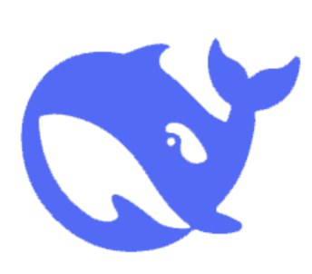
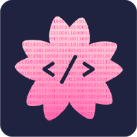
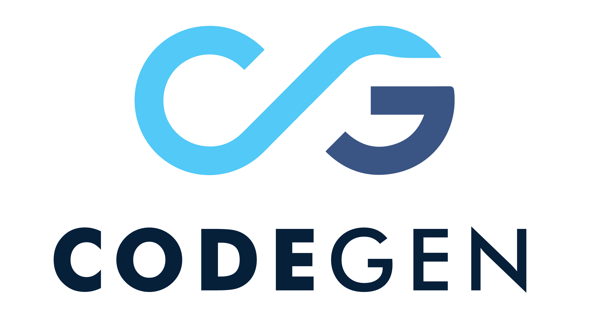
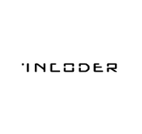

# 🛡️ adversarial-codegen

[](https://opensource.org/licenses/MIT)
[](https://www.python.org/downloads/)
[](https://github.com/yourusername/adversarial-codegen)

This repository evaluates the robustness of Large Language Models (LLMs) under various adversarial attacks, focusing on code generation tasks. We test both original and compressed LLMs across different datasets to provide comprehensive insights into model vulnerabilities.

## 📊 Overview
Our framework provides:
- 🔨 Implementation of various adversarial attack methods for code generation
- 🤖 Support for multiple LLM architectures (both original and compressed)
- 📈 Extensive evaluation across diverse coding datasets
- 🎯 Standardized benchmarking and comparison tools
- 📊 Visualization tools for analysis

## 🚀 Supported Models
We currently support the following models:
-  [CodeLLaMA](https://github.com/meta-llama/codellama)  <!-- Download from Meta's official repo -->
  - llama-3.2-1b
  - llama-3.2-3b
  - llama-3.1-8b
-  [DeepSeek](https://github.com/deepseek-ai/DeepSeek-Coder-V2)   <!-- From DeepSeek official website -->
  - deepseek-coder-1.3b
  - deepseek-coder-6.7b
  - deepseek-coder-33b

## 🛠️ Implemented Attack Methods
1. ⌨️ Character Attack (char_attack)
   - Introduces character-level perturbations
   - Randomly change character cases

2. 🔄 Synonym Attack (synonym_attack)
   - Replaces words with semantically similar alternatives
   - Preserves overall meaning while testing robustness

3. 🌐 Translation Attack (translate_attack)
   - Applies back-translation perturbations
   - Tests model resilience to paraphrasing

## 🚀 Supported Models (In Plan)
We will support both original LLMs and their compressed versions.

-  [StarCoder](https://github.com/bigcode-project/starcoder)  <!-- From BigCode/HuggingFace --> :muscle:
-  [CodeGen](https://github.com/salesforce/CodeGen)     <!-- From Salesforce --> :muscle:
-  [InCoder](https://github.com/dpfried/incoder)     <!-- From Meta/Facebook --> :muscle:
- 🎩 [Magicoder](https://github.com/ise-uiuc/magicoder) :muscle:

## 🛠️ Implemented Attack Methods (In Plan)
1. 🎯 Natural Noise Injection
   - ⌨️ Typos and character swaps
   - 📝 Spacing and formatting variations
   - 💭 Comment modifications

2. 🏗️ Structural Attacks
   - 🔄 Variable name perturbations
   - 🔀 Control flow modifications
   - 🔌 API usage variations

3. 🔄 Semantic Preserving Transformations
   - 🔧 Code refactoring
   - 🔁 Equivalent syntax modifications
   - 🧮 Logic preservation with structural changes

## 📚 Datasets
- 👥 HumanEval / HumanEval Plus
- 📘 MBPP / MBPP Plus

## ⚙️ Installation

We recommend using [UV](https://github.com/astral-sh/uv) as the package installer for better dependency management and faster installation.

### Install UV
First, install UV using one of the following methods:

```bash
# For Linux/macOS with curl
curl -LsSf https://astral.sh/uv/install.sh | sh

# For Windows (PowerShell)
powershell -c "irm https://astral.sh/uv/install.ps1 | iex"

# Using pip (recommended)
pip install uv
```

### Basic Installation
If you only need basic functionality only with bitsanddytes quantization support:
```bash
# Clone the repository
git clone https://github.com/yourusername/adversarial-codegen
cd adversarial-codegen

# Install the package with basic dependencies
uv pip install -e .
```

### Full Quantization Support
If you want to use all quantization features:
```bash
# Clone the repository
git clone https://github.com/yourusername/adversarial-codegen
cd adversarial-codegen

# Install PyTorch first
uv pip install torch>=2.5.1

# Install with quantization dependencies
uv pip install --no-build-isolation -e .[quant]
```

### Full Installation (Recommended)
```bash
# Clone the repository
git clone https://github.com/yourusername/adversarial-codegen
cd adversarial-codegen

# Install PyTorch first to avoid build issues
uv pip install torch>=2.5.1

# Install all dependencies including quantization support
uv pip install --no-build-isolation -e .[all]
```


### Using pip (Alternative)
If you prefer using traditional pip:
```bash
# Clone the repository
git clone https://github.com/yourusername/adversarial-codegen
cd adversarial-codegen

# Install PyTorch first
pip install torch>=2.5.1

# Install all dependencies
pip install --no-build-isolation -e .[all]
```

Note: The `--no-build-isolation` flag is needed for proper installation of quantization dependencies like `autoawq`. UV is recommended over pip for its improved dependency resolution and installation speed.

## 🎮 Usage
After installation, you can use the main functionality through the command-line interface. The framework provides two command-line interfaces:

### 1. Full Evaluation Mode
```bash
adversarial-codegen attack [OPTIONS]
```

### 2. Quick Test Mode (5 samples)
```bash
adversarial-codegen-test attack [OPTIONS]
```

### 🔑 Required Arguments

- model_path: 📂 Path to the original model

### ⚡ Optional Arguments

#### 🤖 Model Configuration
- model_type: Type of model (default: "codellama")
- quantized_type: 🔧 Type of quantized model (optional)

#### 💾 Save Options

- save_prompts: Save generated prompts to the specific directory.
- save_results: Save attack results to the specific directory.

#### 📚 Dataset Options
- dataset: 📚 Dataset to use ("humaneval" or "mbpp", default: "mbpp")
- mini: 🔍 Use mini version of dataset (flag)

#### 🎯 Attack Parameters
- attack_method: Type of attack ("synonym", "random upper", "translate-and-back")
- replacement_prob: Probability of replacement (default: 0.15)
- max_synonyms: Maximum number of synonyms (default: 3)
- input_type: Type of input (default: "prompt")
- seed: Random seed for reproducibility

#### 📦 Quantization Parameters
- quant_method: Static quantization method ("bnb", "gptq", "awq")
- quant_bits: Number of bits for quantization (4 or 8)
- quant_type: Quantization type for 4-bit static quantization ("nf4", "nf4_2", "nf4_3")
- quantize_embeddings: Whether to quantize embeddings (for dynamic quantization)

#### 📊 Visualization
- visualization: Enable/disable visualization output (default: False). Require save_results to be set.

#### ⚙️ Generation Parameters
- num_return_sequences: Number of responses to generate (default: 1)
- max_length: Maximum generation length (default: 512)
- temperature: Temperature for sampling (default: 0.7)
- top_p: Top-p for sampling (default: 0.95)
- num_beams: Number of beams for beam search (default: 10)
- use_beam_search: Whether to use beam search (default: False)

## 📝 Examples

### 1. 🔰 Basic Usage:
```bash
# Attack original LLMs, full evaluation
adversarial-codegen attack \
    --model_path /path/to/model \
    --save_prompts /path/to/save/prompts \
    --save_results /path/to/save/results

# Quick test
adversarial-codegen-test attack \
    --model_path /path/to/model \
    --save_prompts /path/to/save/prompts \
    --save_results /path/to/save/results
```

### 2. 🚀 Advanced usage with custom parameters:
```bash
# Attack LLMs with a specific adversarial attack method (synonym) and generation method (temperature sampling).
adversarial-codegen attack \
    --model_path /path/to/model \
    --dataset mbpp \
    --attack_method synonym \
    --replacement_prob 0.2 \
    --max_synonyms 5 \
    --temperature 0.8 \
    --top_p 0.9 \
    --num_beams 5 \
    --seed 42 \
    --save_prompts /path/to/save/prompts \
    --save_results /path/to/save/results \
    --visualization True
```

### 3. 🔧 Using Static Quantization:
```bash
# Attack LLMs with static quant (4-bit quant achieved by bnb)
adversarial-codegen attack \
    --model_path /path/to/model \
    --quantized_type static \
    --quant_method bnb \
    --quant_bits 4 \
    --quant_type nf4 \
    --save_prompts /path/to/save/prompts \
    --save_results /path/to/save/results
```

### 4. 🔄 Using Dynamic Quantization:
```bash
# Attack LLMs with 8-bit quant
adversarial-codegen attack \
    --model_path /path/to/model \
    --quantized_type dynamic \
    --quant_bits 8 \
    --quantize_embeddings True \ # Generally don't quantize embedding layer
    --save_prompts /path/to/save/prompts \
    --save_results /path/to/save/results
```

## 📤 Output
The tool generates two types of outputs:

1. 📝 Prompts: Saved to the directory specified by --save_prompts
- Original prompts
- Adversarially modified prompts


2. 📊 Results: Saved to the directory specified by --save_results
- Model responses to original prompts
- Model responses to adversarial prompts
- Performance metrics and analysis

3. 📈 Visualizations: (When --visualization is enabled)
   - Venn diagrams showing overlap between different attack methods
   - Saved in the output folder

## 👥 Contributing
We welcome contributions! Please feel free to submit a Pull Request.
For questions or suggestions, please contact:

- 📧 Email: <a href="mailto:fangsen1996@gmail.com">fangsen1996@gmail.com</a>/<a href="mailto:sfang9@ncsu.edu">sfang9@ncsu.edu</a>
- 💬 Open an issue
- 🔀 Submit a PR

## 🙏 Acknowledgments
This project builds upon and is inspired by several excellent works in the field:

- 🤗 HuggingFace Transformers - For transformer models and utilities
- 📚 MBPP Dataset - For evaluation datasets
- 🧪 HumanEval - For evaluation protocols and datasets
- ⚡ PEFT - For efficient model fine-tuning methods
- 🔍 EvalPlus - For enhanced evaluation methods

Special thanks to all these projects that made our work possible.

## 📄 License
This project is licensed under the MIT License - see the LICENSE file for details.


